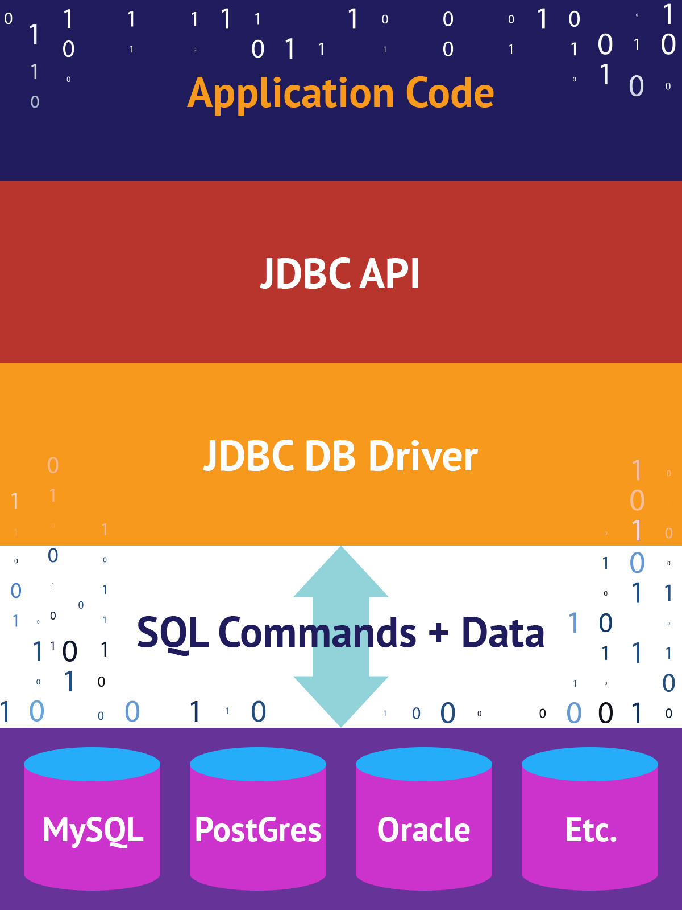

## Project Demo using JDBC and DAO

JDBC (Java Database Connectivity) is the Java API that manages connecting to a database, issuing queries and commands, and handling result sets obtained from the database.

DAO (Data Access Object) is a structural pattern that allows us to isolate the application/business layer from the persistence layer (usually a relational database, but it could be any other persistence mechanism) using an abstract API.

